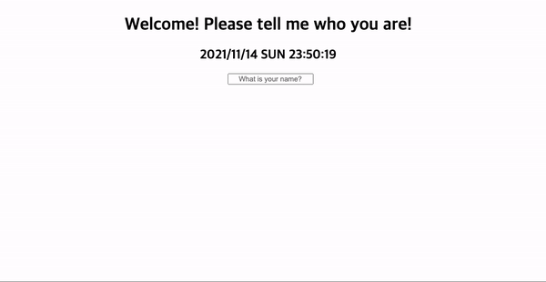

# Mutnemom

> 2021년 7월 13일 ~ 9월 6일<br>
> [Momentum](https://chrome.google.com/webstore/detail/momentum/laookkfknpbbblfpciffpaejjkokdgca) clone using `Vanilla JS`<br>
> 수정을 위한 준비 중입니다. 이전 코드는 `legacy` 폴더에서 확인할 수 있습니다.

## 🖇️ Contents
- [Mutnemom](#mutnemom)
  - [🖇️ Contents](#️-contents)
  - [💻 Stack](#-stack)
  - [💡 Features](#-features)
    - [1. Clock](#1-clock)
    - [2. Save and Load user name](#2-save-and-load-user-name)
    - [3. TODO List](#3-todo-list)
    - [4. Future works](#4-future-works)

<h3 align='center'>Preview</h3>
<p align='center'>
  
</p>

## 💻 Stack
<p>
  
  
  
</p>

## 💡 Features

### 1. Clock
   * Date 객체와 setInterval 함수를 통한 현재 시간 표시
   ```javascript
   // get current time
   function getCalendar() {
   
     // ...
     
     const date = new Date()
     const year = date.getFullYear()
     const month = date.getMonth() + 1
     const day = date.getDate()
     const dayOfWeek = date.getDay()
     const hour = date.getHours()
     const minute = date.getMinutes()
     const sec = date.getSeconds()
     
     // ...
   }
   
   // update time per second
   setInterval(getCalendar, 1000)
   ```
   
### 2. Save and Load user name
   * `localStorage` 활용
      * 유저 이름이 비어 있을 경우 `input` 태그를 통해 유저 이름 입력, `localStorage`에 저장
      ```javascript
      mainContent.classList.add(HIDE)
      todoDiv.classList.add(HIDE)

      function submitHandler(e) {
          e.preventDefault();
          if(nameInput.value !== '') {
              styling()
              localStorage.setItem(USER_NAME, nameInput.value)
              title.innerText = `Hello! ${nameInput.value}`
          } else {
              nameInput.value = ''
              return
          }
          nameInput.value = ''
      }
      ```

      * 유저 이름이 있을 경우 `input` 태그 숨김, 불러와서 유저 이름 표시
      ```javascript
      if(userName !== null) {
          styling()
          title.innerText = `Welcome! ${userName}`
      } 
      ```

      * 유저 이름을 클릭하여 기존 저장 이름 제거 후 새로운 이름 설정 가능
      ```javascript
      function clickHandler() {
          localStorage.removeItem(USER_NAME)
          location.reload()
      }
      ```
   
### 3. TODO List
  * todo 추가/제거
  ```javascript
  function saveTodoList(keyName, todoList) {
      localStorage.setItem(keyName, JSON.stringify(todoList))
  }

  function deleteTodoList(todoList, li) {
      const filteredTodos = todoList.filter((todo) => {
          return todo.id !== parseInt(li.id)
      })
      return filteredTodos
  }
  ```

  * 추가된 todo `localStorage` 저장, 화면이 다시 로딩되도 화면에 표시
  ```javascript
  const todos = localStorage.getItem(CURRENT_TODO)

  if(todos !== null) {
      const parsedTodos = JSON.parse(todos)
      todayTodoUl.classList.add(SHOW)
      
      parsedTodos.forEach((todo) => {
          paintTodo(todo)
      })
  }
  ``` 

### 4. Future works
   1. TODO 완료 및 되돌리기 기능 구현
   2. 페이지를 로딩할 때 저장된 이미지가 랜덤하게 배경으로 설정됨
   3. 브라우저 위치 권한 허가 및 날씨 API를 통한 현재 위치의 날씨 표시
